# 월드 컴포저를 통한 실제 지형 Obj 파일 추출

디지털 트윈 환경을 구축하기 위해서 실제 지형 정보를 불러와야 할 경우가 있다.

단순하게 위성사진과 같은 실제 지형 텍스처가 아니라

물리 해석에 이용될 수 있는, 높이까지 포함된 지형 객체가 필요한 경우,

(게시글 작성 기준) 55$ 정도의 유니티 유료 에셋들을 이용한

실제 지형 Obj 파일을 추출하는 방법 공유한다.

> 🚨 **WARNING !**
> 
> 해당 방법으로는 말 그대로 "지형"데이터를 추출 할 뿐, 건물이나 나무 등 디테일한 높이는 가져올 수 없다.

---

## 1. 준비물

다음과 같은 준비가 필요하다.

- [Unity Editor 2019.4.0 이상 버전](https://unity3d.com/kr/get-unity/download/archive)
- [Blender](https://www.blender.org/download/)
- [Wolrd Composer](https://assetstore.unity.com/packages/tools/terrain/world-composer-13238)
- [Terrain To OBJ](https://assetstore.unity.com/packages/tools/terrain/terrain-to-obj-170663)

> 🚨 **WARNING !**
> 
> 실제 지형을 Terrain으로만 가져올 생각이라면, ```Terrain To OBJ``` 에셋은 다운로드 받을 필요가 없다

---

## 2. 주소의 위도 경도 알아내기

일단 실제 지형의 정확한 좌표가 필요하다.

여기서 좌표는 **위도**와 **경도**인데, 만약 이를 모른다면 Google map를 통해 알아내야 한다.

본 예제에서는 ```동복북촌풍력발전단지```의 실제 지형 객체를 받아보도록 한다.

일단, [Google Map](https://map.naver.com/v5/)에 접속해, 주소를 입력한다.

지도에서 원하는 위치를 한번 누르고, 같은 위치를 누르면 숫자가 2개가 뜨는데,

각각 위도(Latitude)와 경도(Longitude)이다.

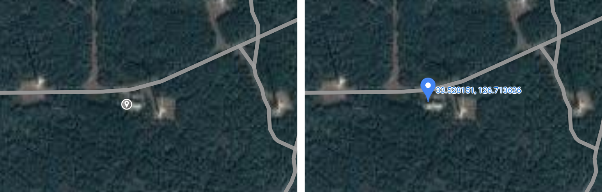

> 동복북촌풍력발전단지 위도, 경도
>
> |       | Latitude  | Longitude  |
> |:------|:----------|:-----------|
> | Value | 33.528151 | 126.713626 |

---

## 3. Unity Project 생성

유니티 프로젝트를 생성하고, 두 에셋을 다운로드 받는다.

Terrain OBJ가 Unity 2019.4.0 이상 버전에서 동작한다고 하기 때문에,

Unity는 2019.4.0로 설치하도록 한다.

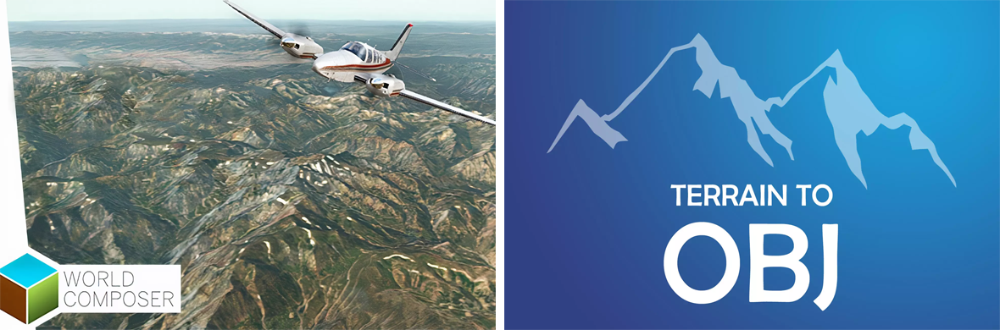

---

## 4. 실제 지형을 Unity Terrain으로

일단 데이터에 엑세스 하려면, 무료로 제공되는 Bing 개발자키를 만들어야 한다.

무료 개발자키를 통해 프로젝트를 구현할 경우, 24시간동안 50,000건의 API 호출을 할 수 있다.

[여기](http://msdn.microsoft.com/en-us/library/ff428642.aspx)에서 Bing 계정과 개발자키를 발급 받을 수 있는데,

**Application type**은 ```Public Windows app```이나 ```Windows Phone app```을 선택하도록 한다.

다른 타입의 경우, 시간에 관계 없이 125,000건의 API 호출 권한을 부여하고, 모든 호출을 사용하면 Key가 만료되기 때문이다.

키를 얻었다면, 유니티 에디터에서 ```Window - World Composer```에 들어간다.

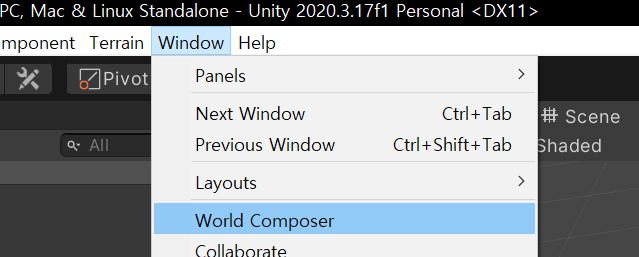

그러고 나면창이 하나 뜨는데, 왼쪽 구석의 ```Map Parameters```에 아까 얻은 Bing API 키를 넣어주고 ```F5```를 눌러 새로고침한다.

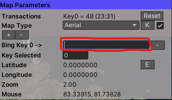

그 후, Latitude와 Longtitude 옆에 ```E```를 눌러, 아까 얻은 위도와 경도를 입력한다.

여기서는 ```33.52815```, ```126.713626```이다.

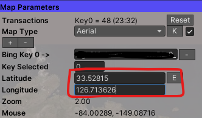

그럼 아래 그림처럼 원하는 위치로 이동하는 모습을 볼 수 있다.

마우스 좌클릭과 휠로 원하는 위치가 중앙에 오도록 잘 배치한다.

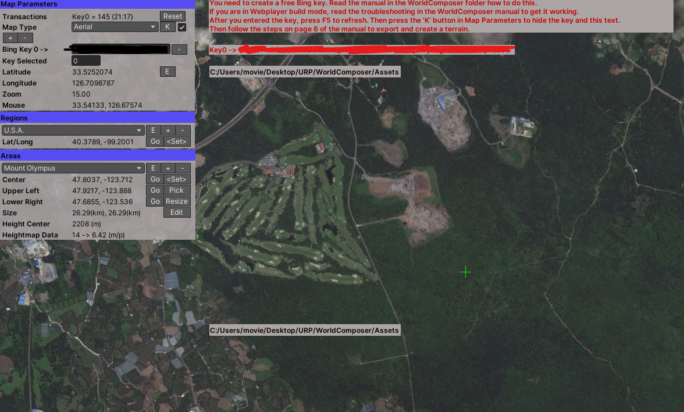

그 후, ```Areas```에서 어느 정도 영역을 Export할 것인지 정하면된다.

만약 ```Areas```가 안보인다면, 창의 상단에서 ```Regions```를 눌러준다.

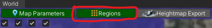

```Areas```에서, ```+``` 버튼을 누른다. 그 후, ```E```를 누르면 해당 설정의 이름을 변경 할 수 있다.

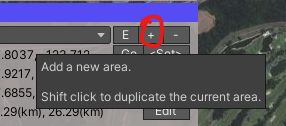

그 후, ```Pick``` 버튼을 눌러 원하는 구역을 만들어준다.

여러번의 시도를 통해 노란색 영역을 예쁘게 잡아보도록 한다.

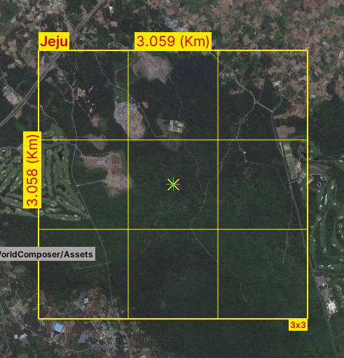

다음은 **Height Map**을 얻어야한다.

```Heightmap Exporter```에서 작업한다.

만약 못찾겠으면, 상단의 버튼을 눌러 띄워준다.

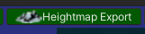

창을 열어서, ```Export Heightmap```버튼을 눌러준다.


버튼을 누르면 뭔가 작업을 진행하는데, 잠깐 기다린다.

다음은 Image를 만들어야하므로, ```Image Exporter```를 띄워준다.

만약 없으면 상단의 버튼을 찾아 눌러준다.

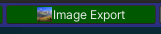

그리고나서, ```Export Image```버튼을 눌러준다.

이 작업은 시간이 조금 걸리는 편인데,

영역이 크면 클 수록 오래걸리므로, 잠시 기다리면 된다.

설정한 구역에서 작은 네모들이 움직이며 이미지를 추출하는 모습을 볼 수 있다.

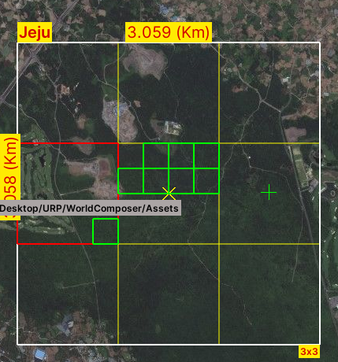


완료 되었으면, ```Create Terrain```으로 간다.

만약 없으면 윈도우 상단의 버튼을 눌러 창을 띄워준다.

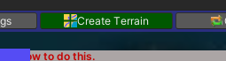

```Create Terrin```버튼을 눌러준다.

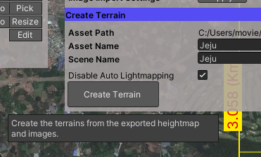

잠시 기다리면, 실제 지도 지형과 같은 Unity Terrain이 생성된다!

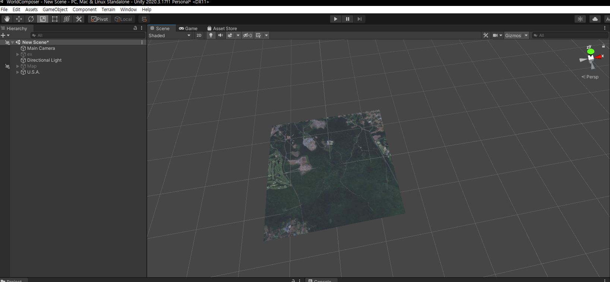

본 예제에서는 하필 매우 평평한 지역을 골라서 큰 차이가 없어 보이는데,

산악 지형을 고르면 크게 차이가 나는 모습을 볼 수 있다.

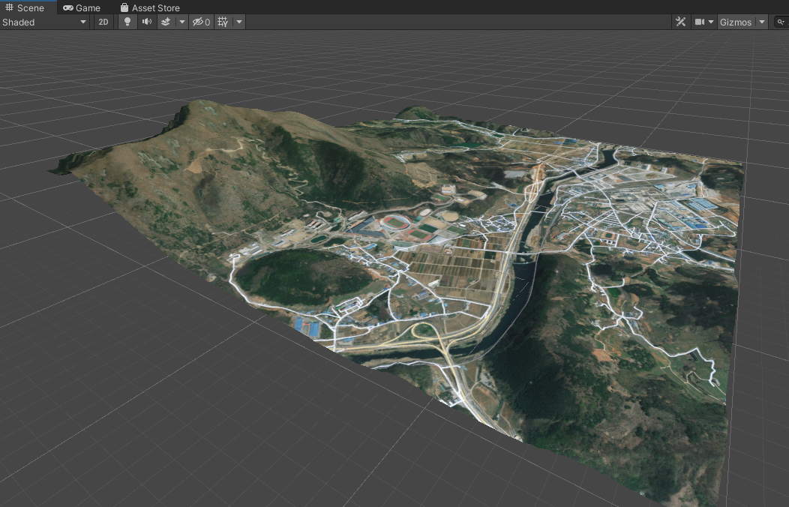

만약 Unity Terrain만 필요한 상황이라면, 여기까지만 진행해도 된다.

---

## 5. Unity Terrain을 Obj로

4번을 통해 만든 Unity Terrain을 Obj로 만드는 방법을 소개한다.

Unity Editor 상단의 ```Window - Amazing Assets - Terrain To OBJ```를 누른다.

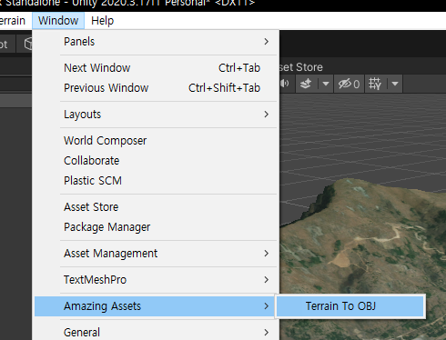

Save 항목에서 Lacation을 ```Custom Folder```로 변경하고, 원하는 path를 선택한 다음, 

```Add All Scene Terrain```을 눌러주면, 아까 만든 Terrain이 모두 로드된다.

그후, 창의 하단에 ```Run```을 눌러 실행해주면 된다.

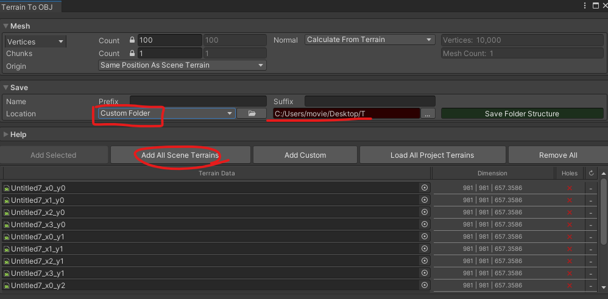

잠시 기다리면, 설정한 위치에 청크 개수만큼 폴더가 생겨있고,

폴더 하나마다 청크 OBJ가 생긴것을 볼 수 있다.

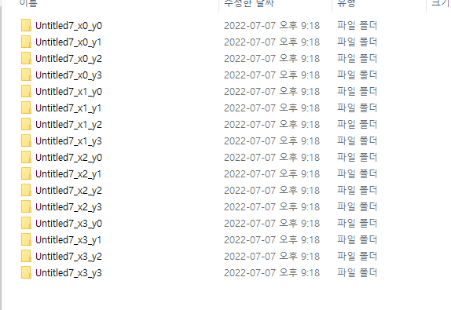

