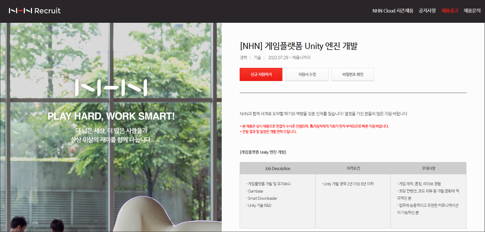
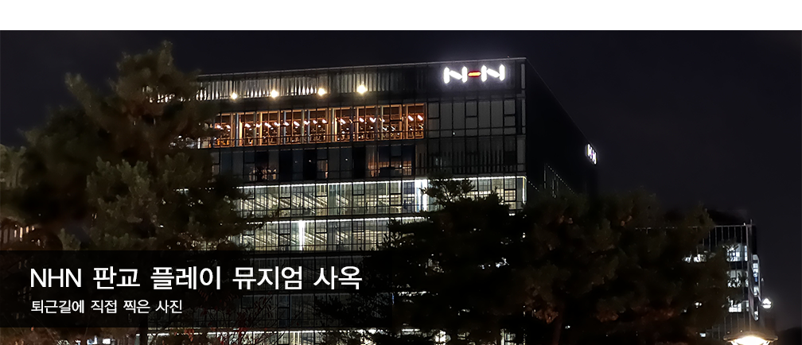
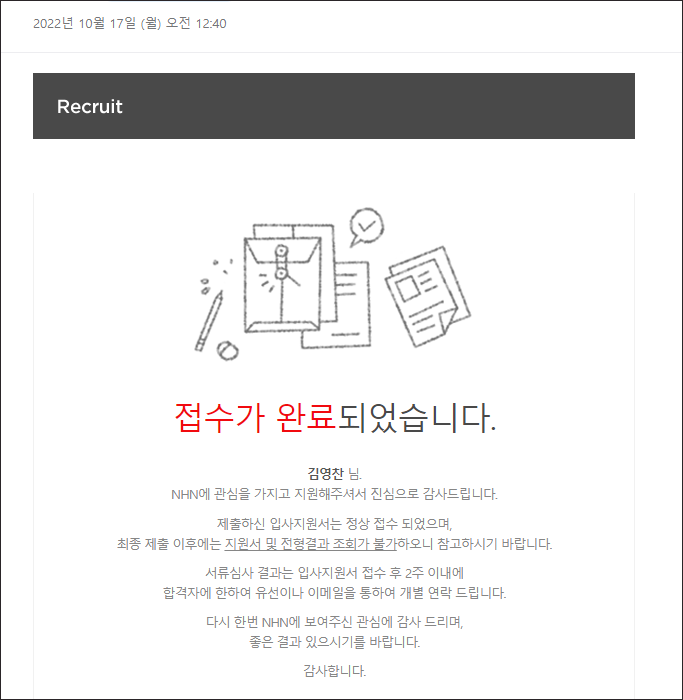
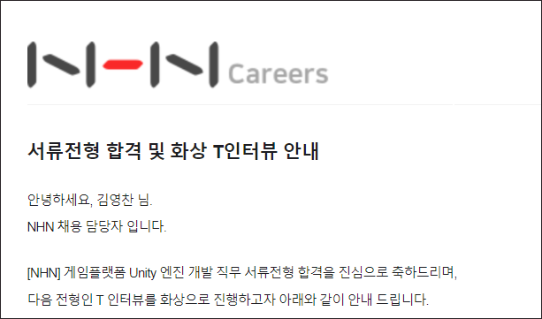
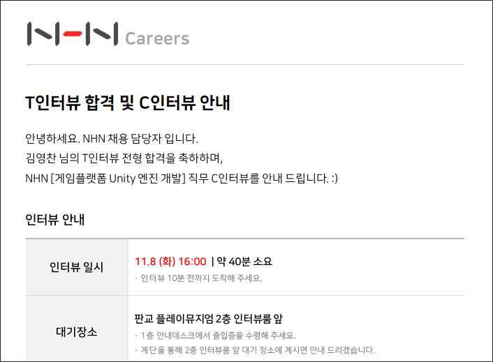
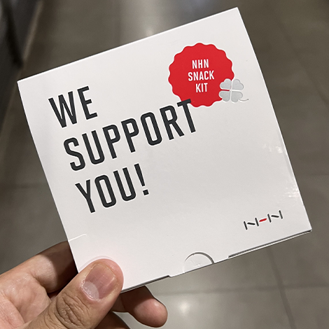

## NHN 게임플랫폼 Unity 엔진 개발자 도전!



이직을 준비하던 중, 평소 관심이 많던 NHN에 내게 적합해보이는 직무를 모집하는 공고를 확인했다.

<table>
<thead><tr><th>Job Description</th><th>자격요건</th><th>우대사항</th></tr></thead>
<tr>
<td width="33.333%"><ul><li>게임플랫폼 개발 및 유지보수</li>
<li>Gambase</li>
<li>Smart Downloader</li>
<li>Unity 기술 R&D</li></ul></td>
<td width="33.333%"><ul><li>Unity 개발 경력 2년 이상 8년 이하</li></ul></td>
<td><ul><li>게임 제작, 론칭, 라이브 경험</li>
<li>코딩 컨벤션, 코드 리뷰 등 개발 문화에 적극적인 분</li>
<li>업무에 능동적이고 유연한 커뮤니케이션이 가능하신 분</li></ul></td>
</tr>
</table>


평소 Unity로 다양한 국가 연구과제를 수행하면서 엔진에 대한 이해도를 높혀온 내게 적합한 포지션이라고 생각하였다.

특히, 모집하고 있는 공고는 NHN에서 제공하고 있는 [Gamebase](https://www.toast.com/kr/service/game/gamebase)에 대한 개발자를 모집하는 공고였다.

평소 동료 개발자들이나 같이 연구에 참여한 컨소시엄의 개발자들을 위해 자주 사용되는 기능들을 모듈화 하고,

에셋으로 만들어 배포한 경험이 있는 내게는 적합한 포지션이라고 생각하여 지원하게 되었다.




출근을 하며 NHN의 건물을 봤을땐 건물 외관이 참 예뻐서 평소 눈여겨 보던 회사였는데, 좋은 기회라고 생각하여 바로 지원하게 되었다.

해당 직무는 경력직으로, ```서류 전형``` > ```T 인터뷰``` > ```C 인터뷰``` > ```최종 합격```순서로 진행한다.

```T 인터뷰```는 흔히 말하는 기술면접이고, ```C 인터뷰```는 인성 면접이라고 보면 된다.

자세한 내용은 필요없고 빨리 정보만 얻고 싶은 사람들을 위해, 내가 지나온 면접 과정을 요약하면 다음과 같았다.


<table>
<thead><tr><th>순서</th><th>과정</th><th>결과 발표까지 걸린 시간</th><th>참고 내용</th></tr></thead>
<tr style="text-align:center;">
<td>1</td>
<td>서류 전형</td>
<td>3일</td>
<td style="text-align:left;"><ul>
    <li>포트폴리오를 미리 준비해두자</li>
</ul></td>
</tr>
<tr style="text-align:center;">
<td>2</td>
<td>T 인터뷰</td>
<td>3일</td>
<td style="text-align:left;"><ul>
    <li>짧은 시간 안에 문제를 파악하고, 해결하는 능력이 필요하다</li>
    <li>C#과 Unity의 기본 지식정도는 학습해 두자</li>
    <li>자소서의 프로젝트에 대한 내용들도 잘 준비해두자</li>
</ul></td>
</tr>
<tr style="text-align:center;">
<td>3</td>
<td>C 인터뷰</td>
<td>1일</td>
<td style="text-align:left;"><ul>
    <li>인성 면접이지만 기술 역량 질문 비중도 크다</li>
    <li>자소서 프로젝트 기반의 질문을 잘 준비하자</li>
    <li>본인을 왜 뽑아야하는지를 잘 어필하자</li>
</ul></td>
</tr>
</table>

각 전형별로 텀이 있었기 때문에 처음 원서 제출하고 7일만에 합격한 것이 아님을 주의해야 한다!

서류 제출은 22년 10월 17일이었고, 최종 합격 발표는 22년 11월 9일이었다.

그리고 너무 당연한 이야기지만, 어디까지나 부서별로 / 상황별로 차이가 있을 수 있으니 참고용으로만 보길 바란다.

---

## 서류 및 포트폴리오 제출

입사 원서를 작성하기 위한 자기 소개및 인적 사항을 작성하고, [간단한 포트폴리오](https://drive.google.com/file/d/1zSOWDjANTsTa1qgFpQkNQEFvbY5kj6cM/view?usp=sharing)를 제출하였다.

포트폴리오는 평소 [GitBlog의 프로필 페이지](https://kimyc1223.github.io/profile/)를 작성하거나 프로젝트를 진행하면서 생긴 이슈를 정리한 내용을 바탕으로

평소에 미리 양식을 만들어 두었기 때문에 쉽게 제출 할 수 있었다.

여담이지만 이 글을 읽는 누군가에게 하고 싶은 말은 

개발자로서 취직이나 이직을 할 때 꼭 필요한 포트폴리오는 미리미리 만들어 두는게 좋다는 것이다.

특히 경력직 이직의 경우, 회사를 다니면서 이직하는 것이기 때문에 퇴근 후에 작성하려고 하면 시간도 부족할 뿐 더러

체력도 부족해 전반적으로 좋은 포트폴리오가 나오기 쉽지 않기 때문이다.

물론 나도 매우 화려하거나 멋진 포트폴리오는 아니었지만, 내가 지나온 날들을 열심히 정리해서 PDF로 만들어두었다.



그렇게 22년 10월 17일 월요일에 메일을 보내게 되었다.

그리고 3일 후, 모르는 전화로 전화가 왔고, 서류 전형에 합격했다는 소식을 접하게 되었다!

유선으로 인사 담당자분이 합격 소식을 전해주셨고, 자세한 내용은 메일로 전달해준다고 하였다.



그리고 10월 19일 오후 5시에 합격 메일을 받게 되었다.

수시 면접이라 연락이 늦게 올 것이라 생각했는데, 매우 빠르게 답장이 와서 놀랐던 기억이 있다.

하지만 기뻤던 마음도 잠시였고, 한 번도 진행해보지 못했던 라이브코딩을 준비해야한다는 압박감에 매우 긴장됐다.

Unity 관련 직무인 만큼, 평소 잘 몰랐던 Unity 기능들과 C# 문법들을 확인하는 시간을 가지며 준비했다.

---

## 라이브 코딩과 함께하는 T 인터뷰

10월 24일, 2시간의 T 인터뷰가 시작됐다.

T 인터뷰는 1:N 화상 면접으로, 소요 시간은 2시간이며 1시간은 라이브 코딩이고 나머지 1시간은 기술 면접이었다.

라이브코딩의 경우, 어떤 문제였는지는 자세하게 적을 순 없지만 일반적인 코딩테스트보다는 실제 업무와 비슷한 문제를 푸는 것이었다.

문제는 확실히 어려운 수준은 아니었으며 확실히 Unity로 직접 개발을 해본 경험이 적은 사람이라면 당황 할 수 있을 정도의 문제였다.

새로운 유형의 코딩 테스트를 긴장하지 않고 받아들일 수 있어야 하고, 여러 사람이 지켜보고 있는 상황에서도

개발을 해 나갈 수 있는 침착함을 유지하는게 좋을 것 같다.

기술 면접은 자세하게 적을 순 없지만, 전반적인 난이도는 중간 정도라고 생각했다.

면접 분위기는 편안한 분위기에서 진행되었고 압박면접은 전혀 없었다.

( 막 유쾌하거나 재밌는 분위기 보다는 정말 차분한 분위기였다. )

돌이켜 생각해 봤을 때 대답을 잘 한 부분도 있었지만 잘못된 대답을 한 부분도 있었고, 아예 모르겠다고 한 부분도 있었다.

사실, 많이 절었던 부분도 있어서 면접이 끝난 후 완전 망해버렸다고 생각했고, 바로 기대를 접었다.

( 난이도는 그렇게 어렵지 않았는데, 대답을 잘 하지 못했다고 생각해서 그런것 같다. )

한숨을 푹푹쉬며 면접 복기를 하며 이번엔 아쉬웠지만 좋은 경험이었다고 생각했는데...

놀랍게도 T 면접 3일 후, 유선으로 합격 소식을 받았다.



그리고 서류 합격때와 마찬가지로 따로 메일이 왔는데, 10월 27일 오후 3시에 통보 받았다.

솔직히 거의 기대를 안하고있었는데, 막상 합격 통보를 받으니 정말 기뻤다.

( [면까몰](https://blog.naver.com/PostView.nhn?blogId=darkship90&logNo=222308366405&parentCategoryNo=&categoryNo=24&viewDate=&isShowPopularPosts=false&from=postView)이라는 말이 괜히 있는게 아니었다! )

좌우간 결과를 상당히 빨리 주셔서 정말 감사했고 곧바로 인성면접을 준비했다.

---

## 대면으로 진행된 C 인터뷰

11월 8일, C 인터뷰가 진행됐다.

C 인터뷰는 1:N 면접으로, 45분정도 진행됐으며, 대면 면접이라 직접 플레이 뮤지엄에 찾아갔다.

맨날 지나다니며 보던 건물에 처음으로 직접 들어갔는데, 건물 내부 인테리어가 매우 이쁘다고 생각했다.

일단 면접 분류는 인성 면접이다. 흔히 생각하는 인성 면접과 거의 비슷한 맥락으로 진행된다.

하지만 기억에 남는 점은 기술 면접때 만큼이나 기술 역량도 같이 평가받는 자리라는 것이다.

조금은 긴장했지만 최대한 잘 설명하려 노력했는데 면접관분들이 말을 집중해서 잘 들어주시고

꼬리 질문도 많이 해주셔서 좋은 면접 경험이었다고 생각했다.

돌이켜 생각해 봤을 때,면접의 주된 주제는 나를 왜 뽑아야 하는가? 였던것 같다.

(당연한 얘기인가...?)

시간이 어떻게 흘러가는지도 모른채 끝이 났고,

안내해주시는 직원분이 고생하셨다며 작은 간식 키트를 선물로 주셨다.



엄청난 선물은 아니었지만 이런 작은 디테일까지 신경쓴다는 점이 크게 인상깊었고, 감동이었다.

면접 결과는 1주~2주 사이에 나온다고 안내를 받았던 것 같다.

그런데... 놀랍게도 바로 다음날 아침 🎉최종 합격🎉이라는 문자를 받았다.


11월 9일 오전 9시에 해당 문자를 받았고, 후속 안내 메일또한 차례로 받게 되었다.

사실 매우 빠른 시간 안에 답장을 받게 되어서 굉장히 놀랐다. (24시간도 지나지 않았으니!)

이 연락을 끝으로 채용 과정은 최종 합격으로 종료되었다.

---

## 마치며

종합해봤을때, 면접에 대한 인상은 긍정적이다!

압박면접보다는 정말 대화하는 식으로 진행됐으며, 딱딱한 분위기보다는 부드러운 분위기였던것 같다.

생각할 시간이 필요한 경우에도 조금 시간을 달라고 부탁했더니 웃으시며 그러라고 하셨다.

<br>

사실 아직까지 실감이 나지 않는 부분이 많다... ㅎㅎ

면접 복기를 했을 때, 부족한 점도 많았는데... 성실히 대답하려고 하는 모습을 좋게 봐주신것 같다고 생각한다.

좋은 기회를 얻은 만큼, 열심히 노력해보고 싶다!