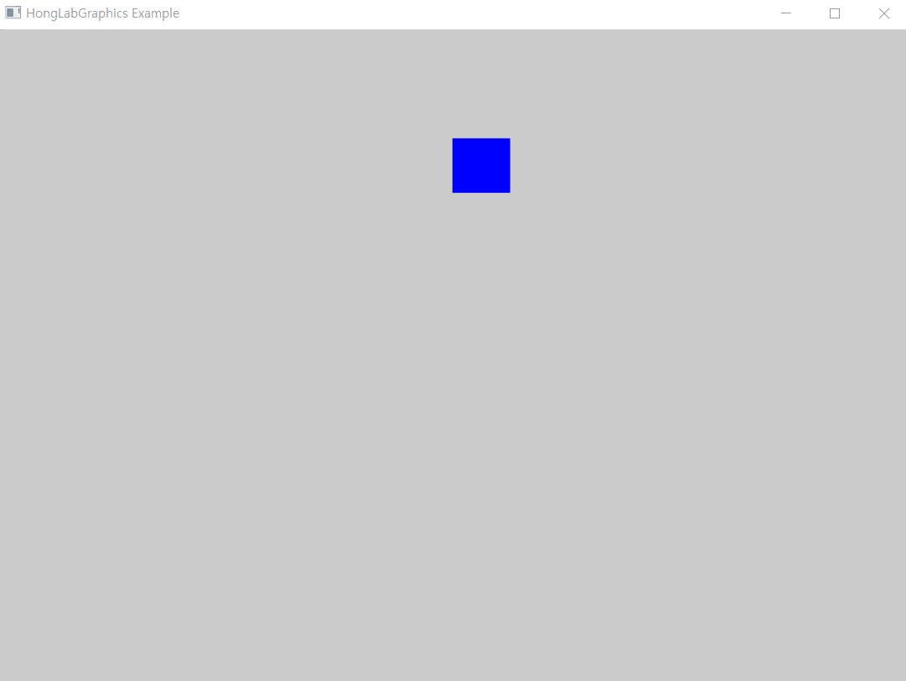
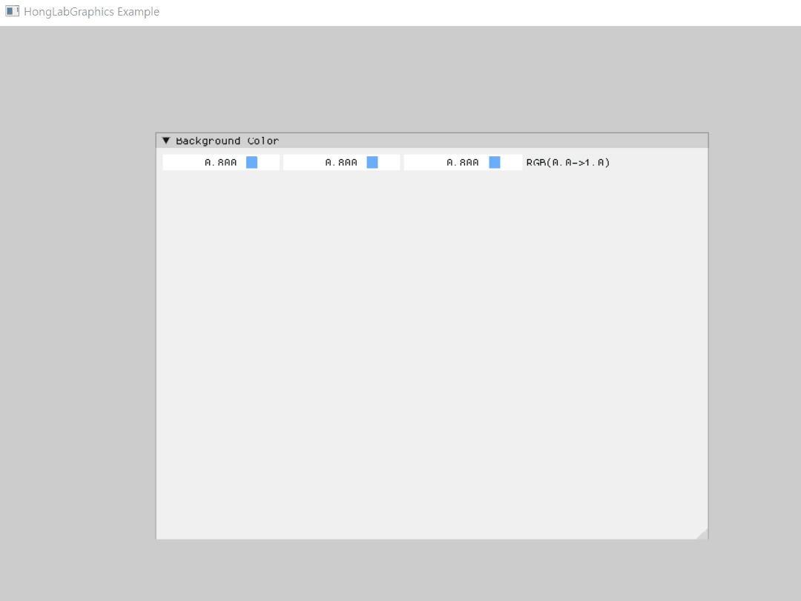

> 본 포스트의 내용은 홍정모 그래픽스 새싹코드 파트 1을 공부하며 기록한 것으로, 직접 인용하거나 요약한 내용임을 밝힙니다. https://honglab.co.kr/courses/graphicspt1

## OT

나는 바닥부터 만들기 모드로 해서 처음부터 다 구현하면서 공부한다.

기술 스택은 DirectX 11과 IMGUI를 사용함.

## 기술 동향

Nvidia, Unreal Engine의 기술적 성과

응용분야

- 엔터테인먼트
  - 게임, 영화, 틱톡, IG, 버튜버 등
- 가시화와 미디어처리
  - 모바일 비디오 처리 등
- 고효율 컴퓨팅
  - 암호화폐, 딥러닝 등

물리엔진

- Nvidia PhysX (언리얼에서 사용)
- Bullet Engine (오픈소스)
- MuJoCo (딥러닝 훈련용으로 많이 사용)

VR / AR

## vcpkg로 IMGUI 설치

vcpkg 명령은 powershell이라면 .\vcpkg 처럼 위치 지정 필요. cmd라면 그냥 vcpkg로 사용

```powershell
git clone https://github.com/microsoft/vcpkg

cd .\vcpkg\

dir

.\bootstrap-vcpkg.bat

vcpkg search imgui

vcpkg install imgui[win32-binding,dx11-binding]:x64-windows

vcpkg integrate install
```

## 1차원 배열을 2차원 배열처럼 사용하기

이걸 모르는 사람이 많다는 것에 좀 놀랐다. Horowitz 책에 나오는 부분인데, 2차원 배열을 펴서 1차원 배열에서 2차원처럼 indexing 하는 것 (i \* width + j). 기본 중의 기본이니까 tabular data를 다룬다면 꼭 알아두어야 함.

실제 미국 대기업에서도 이러한 유형의 문제가 출제된다고 함.

## DX11 초기화와 IMGUI





재밌다..!
