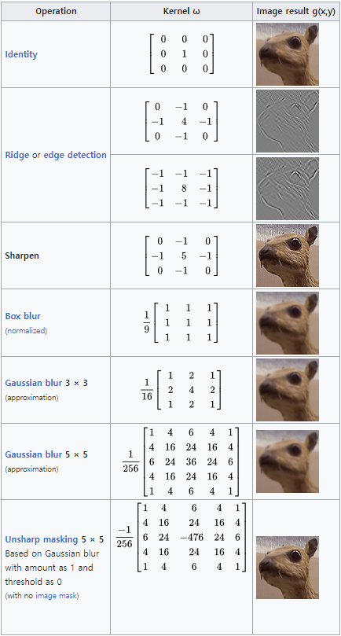
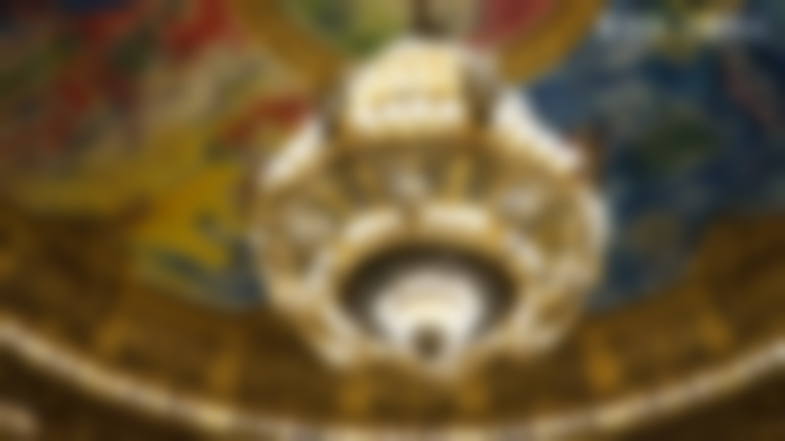
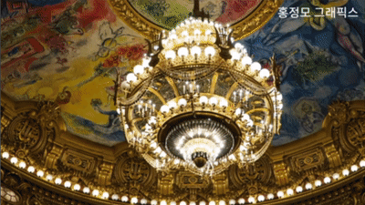
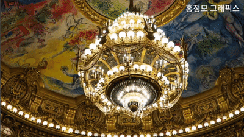

> 본 포스트의 내용은 홍정모 그래픽스 새싹코드 파트 1을 공부하며 기록한 것으로, 직접 인용하거나 요약한 내용임을 밝힙니다. https://honglab.co.kr/courses/graphicspt1

# 2-2 Blur 효과

kernel



Convolution 개념은 요약 생략

padding시에 zero padding 안 하고 가장자리에 해당하는 수로 padding함

---

## Box Blur

box blur 간단하게 구현

kernel size 5로 구현

주변 픽셀의 평균으로 업데이트 (0.2를 곱해서 동등하게 normalizing)

---

원본 이미지


구현 결과



---

아래와 같이 구현

```cpp
// 가로 방향 (x 방향)
#pragma omp parallel for
	for (int j = 0; j < this->height; j++)
	{
		for (int i = 0; i < this->width; i++)
		{
			// 주변 픽셀들의 색을 평균내어서 (i, j)에 있는 픽셀의 색을 변경
			// this->pixels로부터 읽어온 값들을 평균내어서 pixelsBuffer의 값들을 바꾸기

			pixelsBuffer[i + this->width * j].v[0] = 0;
			pixelsBuffer[i + this->width * j].v[1] = 0;
			pixelsBuffer[i + this->width * j].v[2] = 0;

			for (int k = -2; k < 3; k++) {
				Vec4 pixel_get = GetPixel(i + k, j);

				pixelsBuffer[i + this->width * j].v[0] += pixel_get.v[0] * 0.2f;
				pixelsBuffer[i + this->width * j].v[1] += pixel_get.v[1] * 0.2f;
				pixelsBuffer[i + this->width * j].v[2] += pixel_get.v[2] * 0.2f;
			}
		}
	}

// Swap
	std::swap(this->pixels, pixelsBuffer);

	// 세로 방향 (y 방향)
#pragma omp parallel for
	for (int j = 0; j < this->height; j++)
	{
		for (int i = 0; i < this->width; i++)
		{
			pixelsBuffer[i + this->width * j].v[0] = 0;
			pixelsBuffer[i + this->width * j].v[1] = 0;
			pixelsBuffer[i + this->width * j].v[2] = 0;

			for (int k = -2; k < 3; k++) {
				Vec4 pixel_get = GetPixel(i, j + k);

				pixelsBuffer[i + this->width * j].v[0] += pixel_get.v[0] * 0.2f;
				pixelsBuffer[i + this->width * j].v[1] += pixel_get.v[1] * 0.2f;
				pixelsBuffer[i + this->width * j].v[2] += pixel_get.v[2] * 0.2f;
			}
		}
	}

	// Swap
	std::swap(this->pixels, pixelsBuffer);
```

나중에 셰이더 배우고 나면 다시 깔끔하게 구현

---

## Gaussian Blur

Gaussian Blur는 Gaussian으로부터 얻은 가중치를 곱해서, 주변 픽셀이 멀면 작은 가중치를 주도록 함.

여기서는 Gaussian을 계산하지 않고, 일반적으로 쓰이는 가중치를 사용함.

> const float weights[5] = { 0.0545f, 0.2442f, 0.4026f, 0.2442f, 0.0545f };

---

원본 이미지


구현 결과


---

아래와 같이 구현

```cpp
#pragma omp parallel for
	for (int j = 0; j < this->height; j++)
	{
		for (int i = 0; i < this->width; i++)
		{
			// 주변 픽셀들의 색을 평균내어서 (i, j)에 있는 픽셀의 색을 변경
			// this->pixels로부터 읽어온 값들을 평균내어서 pixelsBuffer의 값들을 바꾸기

			pixelsBuffer[i + this->width * j].v[0] = 0;
			pixelsBuffer[i + this->width * j].v[1] = 0;
			pixelsBuffer[i + this->width * j].v[2] = 0;

			for (int k = -2; k < 3; k++) {
				Vec4 pixel_get = GetPixel(i + k, j);

				pixelsBuffer[i + this->width * j].v[0] += pixel_get.v[0] * weights[k + 2];
				pixelsBuffer[i + this->width * j].v[1] += pixel_get.v[1] * weights[k + 2];
				pixelsBuffer[i + this->width * j].v[2] += pixel_get.v[2] * weights[k + 2];
			}
		}
	}

	// Swap
	std::swap(this->pixels, pixelsBuffer);

	// 세로 방향 (y 방향)
#pragma omp parallel for
	for (int j = 0; j < this->height; j++)
	{
		for (int i = 0; i < this->width; i++)
		{
			// 주변 픽셀들의 색을 평균내어서 (i, j)에 있는 픽셀의 색을 변경
			// this->pixels로부터 읽어온 값들을 평균내어서 pixelsBuffer의 값들을 바꾸기

			pixelsBuffer[i + this->width * j].v[0] = 0;
			pixelsBuffer[i + this->width * j].v[1] = 0;
			pixelsBuffer[i + this->width * j].v[2] = 0;

			for (int k = -2; k < 3; k++) {
				Vec4 pixel_get = GetPixel(i, j + k);

				pixelsBuffer[i + this->width * j].v[0] += pixel_get.v[0] * weights[k + 2];
				pixelsBuffer[i + this->width * j].v[1] += pixel_get.v[1] * weights[k + 2];
				pixelsBuffer[i + this->width * j].v[2] += pixel_get.v[2] * weights[k + 2];
			}
		}
	}

	// Swap
	std::swap(this->pixels, pixelsBuffer);
```

최종 결과를 비교해보면, Gaussan Blur가 Box Blur보다 더 윤곽이 또렷함을 확인할 수 있음.

## Animation

업데이트 시에 blur를 적용시켜 점차 blur되는 animation

#### Box blur



#### Gaussian Blur


