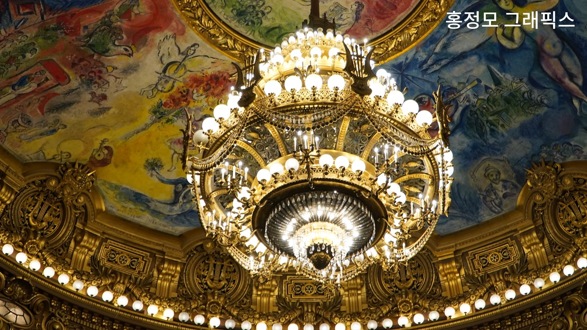
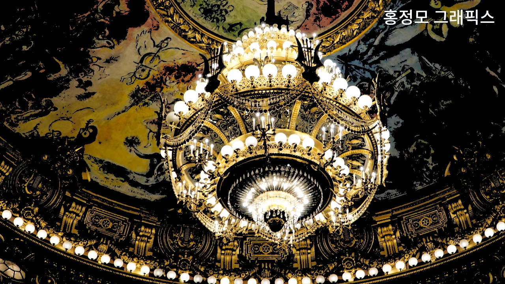
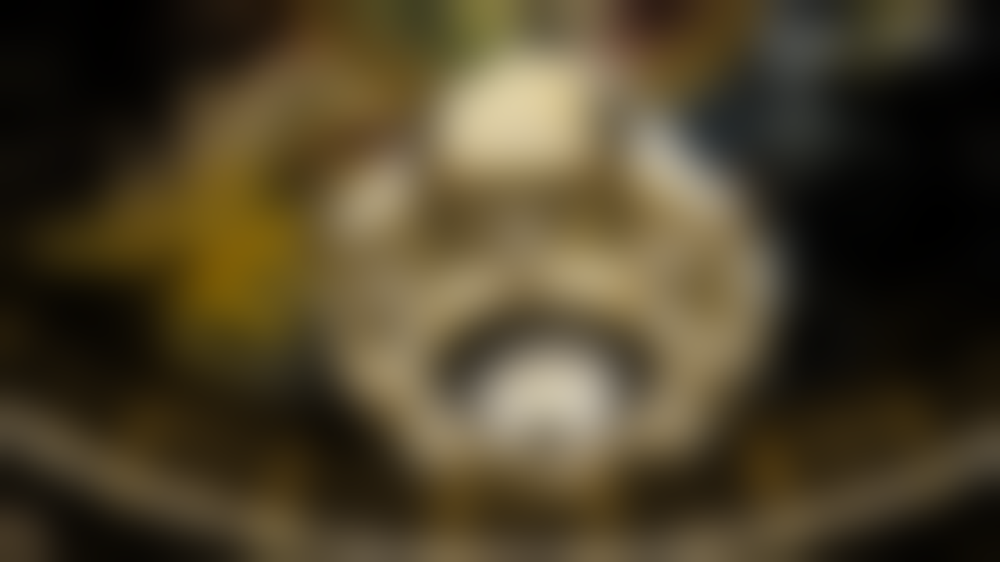
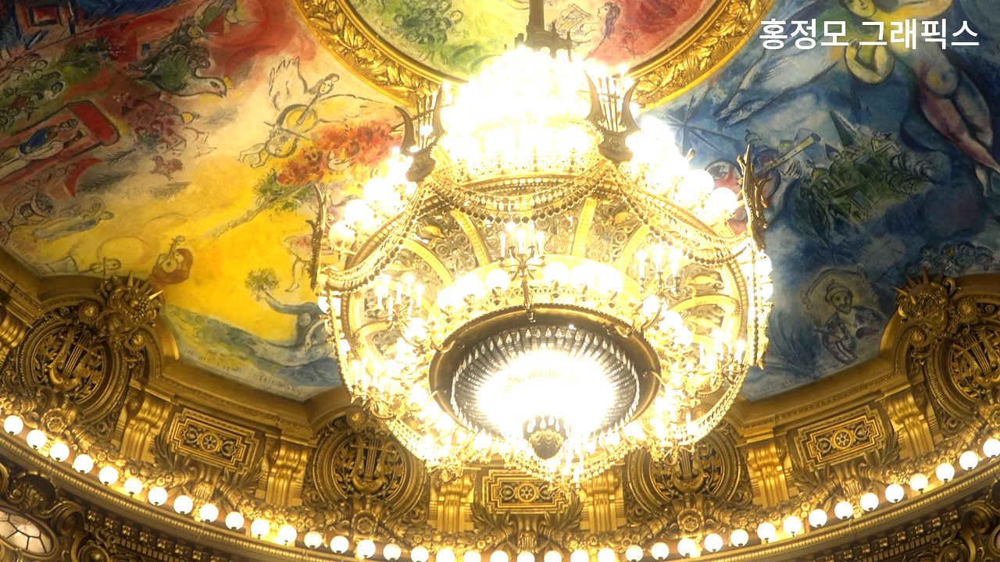

> 본 포스트의 내용은 홍정모 그래픽스 새싹코드 파트 1을 공부하며 기록한 것으로, 직접 인용하거나 요약한 내용임을 밝힙니다. https://honglab.co.kr/courses/graphicspt1

# Bloom 효과

현재 Bloom이 상당히 느림. 나중에 셰이더 할 때 더 빠른 방법을 배움

1. 원본 이미지를 복사한 이미지에서 픽셀의 밝기가 임계값 이하이면 밝기를 0으로 만든다.
2. 복사 이미지에 가우시안 블러를 적용한다.
3. 원본 이미지에 복사 이미지를 더한다.

밝기는 보통 Relative Luminance로 계산한다.

**Relative Luminance Y = 0.2126 R + 0.7152 G + 0.0722 B**

각 단계별로 결과물과 구현을 확인하겠다.

---

원본 이미지



---

## 1. 밝기 임계값 이하인 픽셀값 0으로 만들기 -> 복사 이미지

결과



코드

```cpp

for (int j = 0; j < height; j ++)
for (int i = 0; i < width; i++)
{
	float r = this->pixels[i + j * width].v[0];
	float g = this->pixels[i + j * width].v[1];
	float b = this->pixels[i + j * width].v[2];

	float luminance = relative_luminance_y(r, g, b);

	if (luminance < th) {
		this->pixels[i + j * width].v[0] = 0;
		this->pixels[i + j * width].v[1] = 0;
		this->pixels[i + j * width].v[2] = 0;
	}

}

```

---

## 2. 복사 이미지에 Gaussian Blur 적용

결과



코드

GaussianBlur의 구현은 아래의 글을 참고하면 된다.

[2-2 Blur 구현](/tech/2302171800/)

```cpp

for (int i = 0; i < numRepeat; i++)
{
	this->GaussianBlur5();
}

```

---

## 3. 원본 이미지에 복사 이미지 더해서 Bloom!

결과



코드

```cpp

for (int i = 0; i < pixelsBackup.size(); i++)
{
	this->pixels[i].v[0] = std::clamp(this->pixels[i].v[0] + pixelsBackup[i].v[0] * weight, 0.0f, 1.0f);
	this->pixels[i].v[1] = std::clamp(this->pixels[i].v[1] + pixelsBackup[i].v[1] * weight, 0.0f, 1.0f);
	this->pixels[i].v[2] = std::clamp(this->pixels[i].v[2] + pixelsBackup[i].v[2] * weight, 0.0f, 1.0f);
}

```
